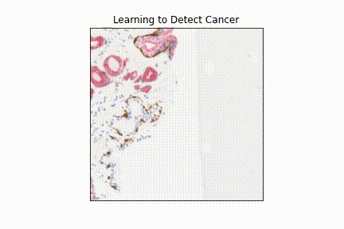
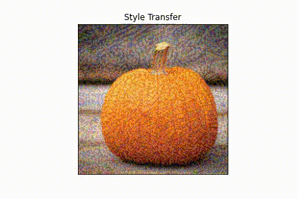

# Michael Mortenson - Data Scientist
Project Portfolio

# [Make an Impact: Cancer Detection](https://github.com/themichaelmort/deep_learning)
* About:
* Neural Network Type: 
* Helpful References:

# [Details Matter: Weight Initialization](https://github.com/themichaelmort/deep_learning)
* About:
* Neural Network Type: 
* Helpful References:

## Uniform

## Xe

## Orthogonal

# [Make Something New : Style Transfer](https://github.com/themichaelmort/deep_learning)
* About:
* Neural Network Type: 
* Helpful References:

### Content Image

### Style Image

# [Build Bridges : Machine Translation](https://github.com/themichaelmort/deep_learning)
* About:
* Neural Network Type: 
* Helpful References:

# [Dig Deeper : Geoacoustic Inversion](https://scholarsarchive.byu.edu/etd/9488/)
* About:
* Neural Network Type: 
* Helpful References:

----------
##Coursework

##Science & Engineering

This repository contains the code for several deep learning projects. All projects are implemented 
in PyTorch and presuppose that the user has a cuda-enabled GPU.

(c) Michael Mortenson 2022

Projects
--------

image_classification.py - Simple 10-category Image Classification
    This project implements a custom vanilla fully-connected neural network with two 1000-neuron 
    layers with ReLu as the activation function. It makes use of the publically available 
    FashionMNIST dataset from torchvision. It defaults to running 100 epochs of training with a 
    batch size of 42 using Stochastic Gradient Descent for the optimizer. PyTorch's 
    CrossEntropyLoss is used for the loss function. Work remains to get a high accuracy with this 
    model, but it exists as an example of classification using a neural network.

weight_initialization_for_CNNs.py - Compare weight initialization strategies for a CNN classifier
    Thie project implements a custom 3-layer CNN and compares the training and accuracy results 
    for performing the FashionMNIST classification task. The three weight initialization 
    strategies explored are as follows:
    - Uniform : Weights randomly initialized based on a uniform distribution
    - Xe (aka Xavier) : Weights randomly initialized based on a uniform 
        distribution, scaled by the square root of the number of input channels
        (https://andyljones.tumblr.com/post/110998971763/an-explanation-of-xavier-initialization)
    - Orthogonal : Weights form an orthogonal set. Orthogonal set created via 
        singular value decomposition. (https://arxiv.org/abs/1312.6120)
    

Unet_cancer_detection.py 
    """
    Custom U-net architecture. 
    Based on architecture from paper (https://arxiv.org/pdf/1505.04597.pdf)

    Modified to work with dataset images.
    """

style_transfer.py
    An alternative application of CNNs, based on the 2016 paper by Gatys et al.
    (https://arxiv.org/pdf/1508.06576.pdf)

translation_with_attention.py
    Helpful Resource: 
    "The Annotated Transformer" : https://github.com/jadore801120/attention-is-all-you-need-pytorch/blob/master/transformer/ 
    "Attention is all you need" : https://arxiv.org/pdf/1706.03762.pdf
    Positional Encoding : https://arxiv.org/pdf/1705.03122.pdf
    Label Smoothing considerations : https://arxiv.org/abs/1512.00567
